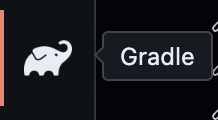
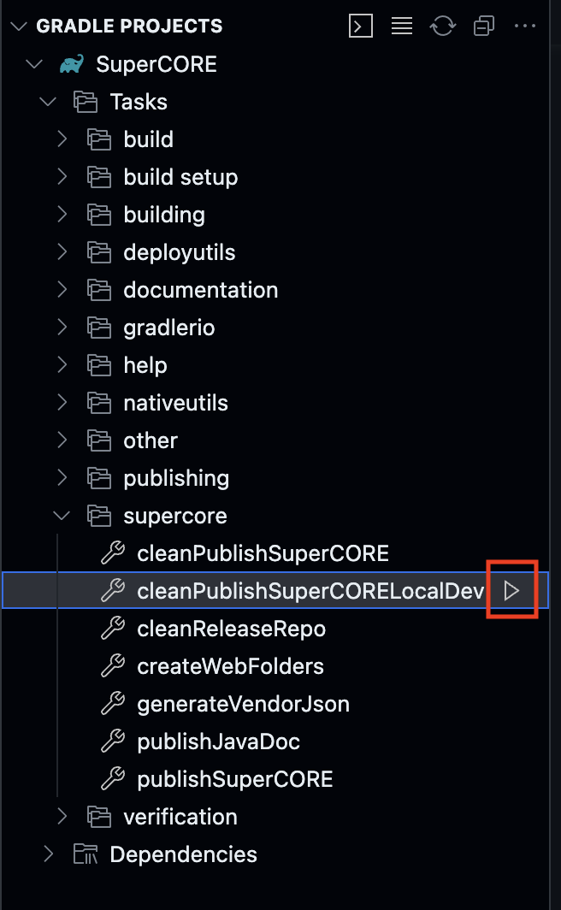
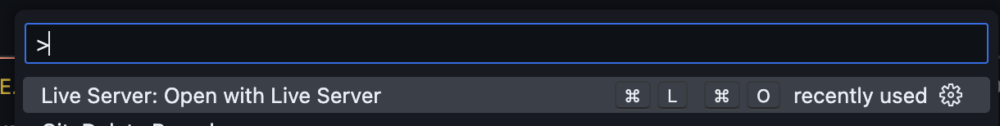

# SuperCORE

SuperCORE is a vendor library for FRC projects. SuperCORE has several uses:

* handles controllers
* adds improved RobotPreferences
* various custom utilities

These are tasks that need to be done every year, so instead of just rewriting all the code, or copying it from last year's project, SuperCORE was created as a vendor library to make it as quick and easy as possible to get a new robot functional.

## Production Installation Instructions

1. In Visual Studio Code press Ctrl + shift + p
2. Type "Manage vendor libraries" into the prompt and hit enter
3. Select "Install new libraries (online)"
4. Copy and paste the following link into the prompt: `https://SuperNURDs.com/installSuperCORE`

## Features

### Supported Controllers

* Logitech F310 Gamepad
  * SN_DualActionStick
  * SN_F310Gamepad
* Logitech Extreme 3D Pro Joystick
  * SN_Extreme3DStick
* Custom Arduino Switchboard
  * SN_SwitchboardStick

### Utilities

* Alternative debug output
  * SN_Debug
  * All SN_Debug message output can be disabled very easily
* Linear Interpolation
  * SN_Math
* Turn CSVs into Motion Profiles
  * SN_MotionProfile

### Robot Preferences

Using the SuperCORE preferences gives the ability to switch between using the hardcoded values and the Network Tables values.

## Competition

It is recommended during a competition that:

* all SN_Debug messages be disabled, making other important error messages more visible.
* hardcoded Robot Preferences are used.
  * This makes the behavior of the Robot based only on the code that the robot is running, and not on any other external factors, like the system that is running the drivers station software

## Documentation

[Java Docs](https://frcteam3255.github.io/SuperCORE/releases/com/frcteam3255/supercore/javadoc-latest/)

## Local Development Installation

> [!Important]
> Prerequisite: Have the following VSCode extensions installed:
>
> * [Gradle for Java Extension](https://marketplace.visualstudio.com/items?itemName=vscjava.vscode-gradle)
> * [Live Server](https://marketplace.visualstudio.com/items?itemName=ritwickdey.LiveServer)

1. Open SuperCORE project/repo in VSCode
2. Select gradle from the sidebar
   1. 
3. Run supercore/cleanPublishSuperCORELocalDev command
   1. 
4. Open Command Palette `(ctrl+shift+p)` and select `Live Server: Open with Live Server`
   1. 
5. Open desired robot project in another VSCode window
6. In the new Visual Studio Code window (**Robot Project**) Open Command Palette `(ctrl+shift+p)`
7. Type "Manage vendor libraries" into the prompt and hit enter
8. Select "Install new libraries (online)"
9. Copy and paste the following link into the prompt: `http://127.0.0.1:5500/releases/com/frcteam3255/supercore/SuperCORE-latest.json`
10. Test robot code with dev SuperCORE
